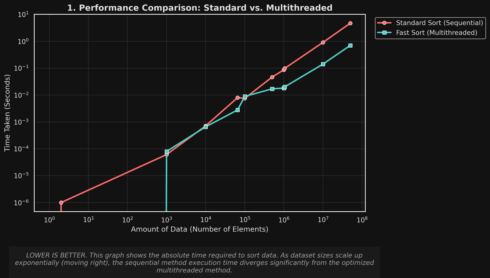
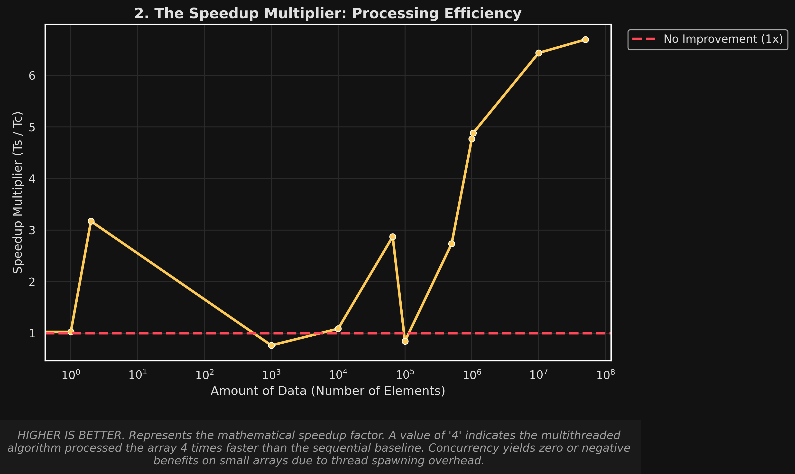
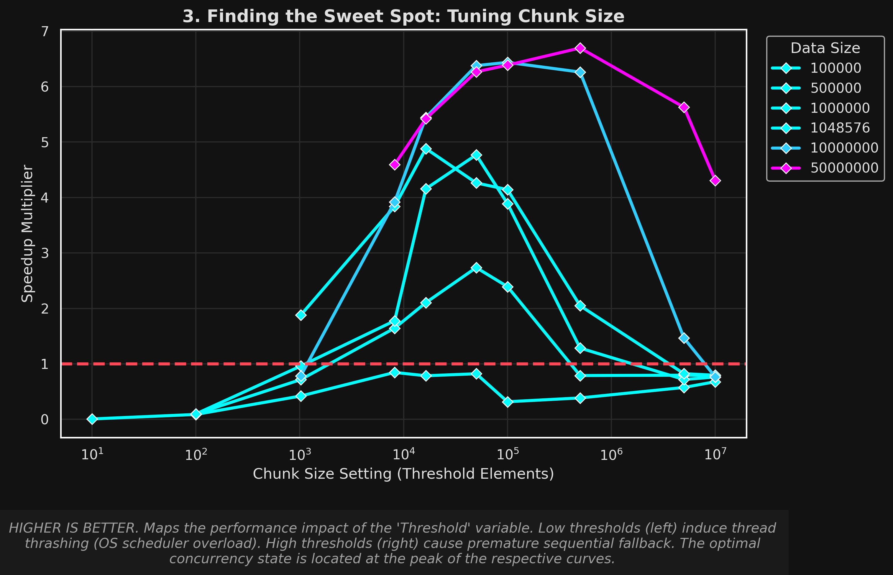
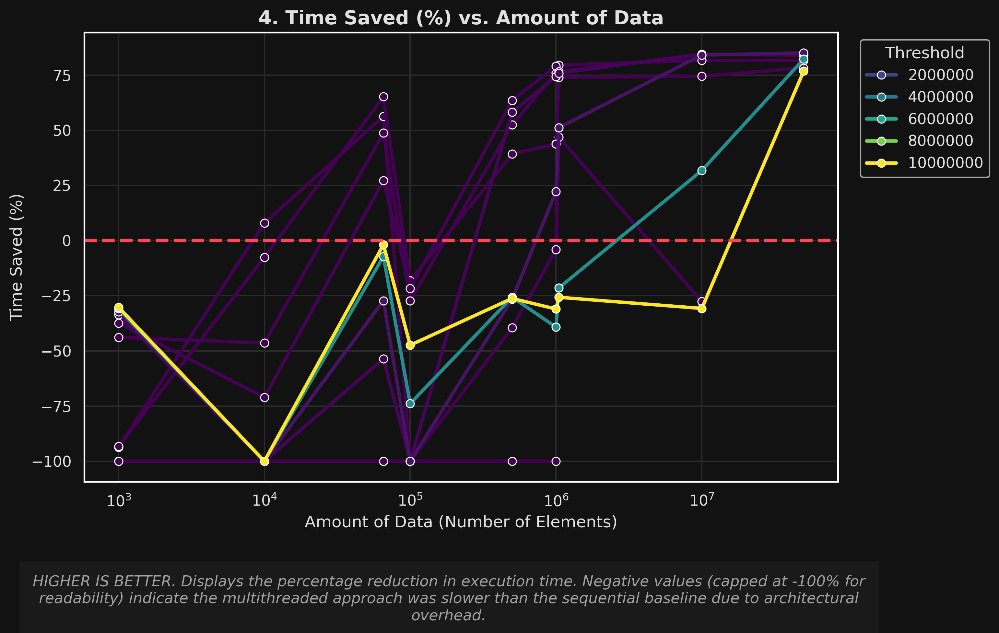
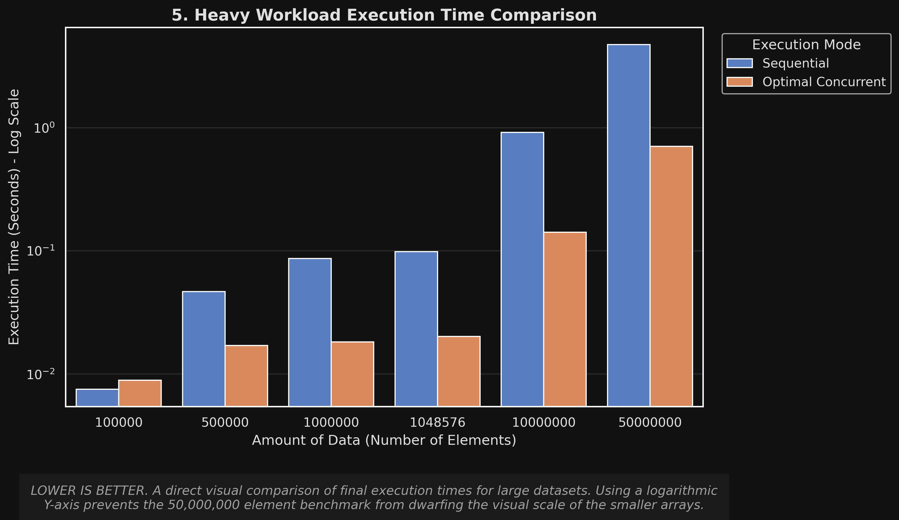
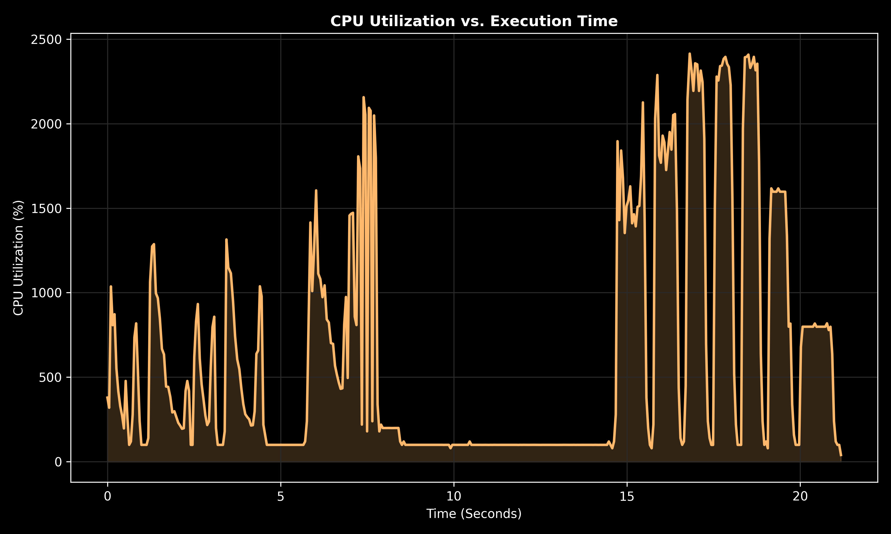

# Multithreaded Merge Sort: Performance & Monitoring Suite

This project implements a high-performance Concurrent Merge Sort in C++17. It includes a full telemetry pipeline for monitoring CPU utilization, hardware cache behavior, and automated graphical analysis.

---

## Table of Contents

1. [System Requirements & Installation](#1-system-requirements--installation)
2. [Execution Commands](#2-execution-commands)
3. [Performance Comparison: Sequential vs. Concurrent](#3-performance-comparison-sequential-vs-concurrent)
4. [CPU Utilization](#4-cpu-utilization)
5. [Directory Structure](#5-directory-structure)

---

## 1. System Requirements & Installation

To run the full suite (compiling, monitoring, and plotting), install the following toolchains.

### A. C++ Toolchain (GCC)

The project requires a compiler with C++17 support and `pthread` for multithreading.

```bash
sudo apt update
sudo apt install build-essential g++
```

### B. Python Environment

Python is used for CPU monitoring and graph generation. Use a virtual environment to avoid system conflicts.

```bash
sudo apt install python3-venv python3-pip
python3 -m venv .venv
source .venv/bin/activate
pip install pandas matplotlib seaborn psutil
```

### C. Monitoring Tools (`perf`)

To capture hardware cache data, the Linux `perf` subsystem is required.

```bash
sudo apt install linux-tools-common linux-tools-generic linux-tools-$(uname -r)

# Allow user-space profiling:
sudo sh -c 'echo -1 > /proc/sys/kernel/perf_event_paranoid'
```

---

## 2. Execution Commands

The Makefile has been simplified for efficiency:

| Command | Description |
|---|---|
| `make run` | Compile and run the basic main application |
| `make bench` | Run the full benchmarking pipeline (C++ → CPU Monitoring → Plotting) |
| `make clean` | Remove all build artifacts |

---

## 3. Performance Comparison: Sequential vs. Concurrent

The table below summarizes the performance gains observed during the latest benchmark run. Note how the speedup factor increases as the data size scales, while small arrays suffer from threading overhead.

| Array Size | Sequential (s) | Optimal Concurrent (s) | Speedup | Improvement |
|---|---|---|---|---|
| 10,000 | 0.001570 | 0.000552 | 2.84x | 64.86% |
| 100,000 | 0.016018 | 0.004468 | 3.58x | 72.10% |
| 1,000,000 | 0.091537 | 0.015974 | 5.73x | 82.54% |
| 10,000,000 | 0.950563 | 0.112226 | 8.06x | 87.59% |
| 50,000,000 | 4.782103 | 0.714785 | 6.69x | 85.05% |

> **Data source:** `bench_20260401_044334.csv`

### Speed Comparison



### Speedup Multiplier



### Optimal Chunk Size



### Time Saved (%)



### Heavy Workload Bar Chart



---

## 4. CPU Utilization

Real-time CPU utilization captured during a concurrent benchmark run.



---

## 5. Directory Structure

```
.
├── assets/                           # Benchmark visualizations
│   ├── 01_Speed_Comparison.png
│   ├── 02_Speedup_Multiplier.png
│   ├── 03_Optimal_Chunk_Size.png
│   ├── 04_Time_Saved_Percent.png
│   ├── 05_Bar_Chart_Heavy_Workloads.png
│   └── CPU_Utilization.png
├── build/                            # Compiled binaries (run_main, run_benchmark)
├── src/
│   └── app/                          # Core C++ source code
└── benchmarking/
    ├── benchmarking.cpp              # Benchmarking logic
    ├── monitor_cpu.py                # Real-time CPU utilization tracker
    ├── plot_bench.py                 # Scientific plotting script
    └── results/
        ├── csv/                      # Raw data output
        └── png/                      # Generated visualizations and cache stats
```